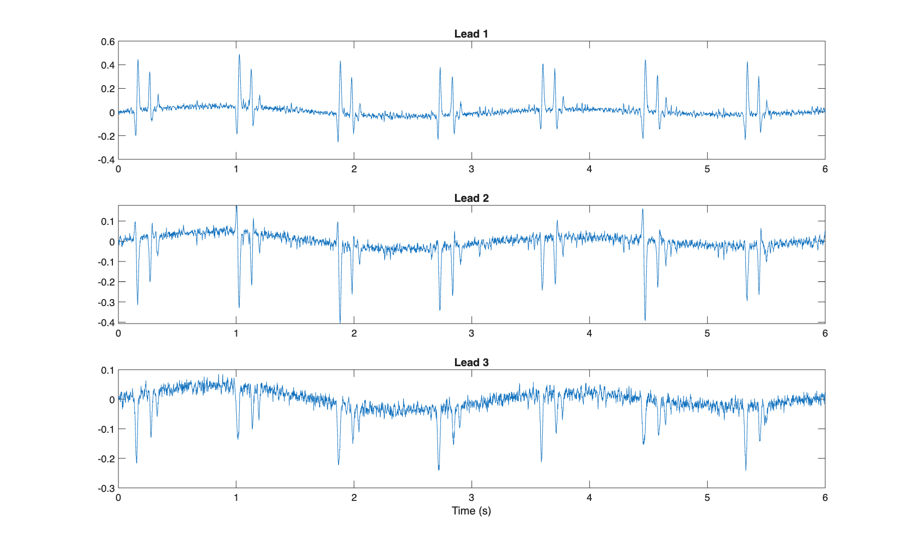
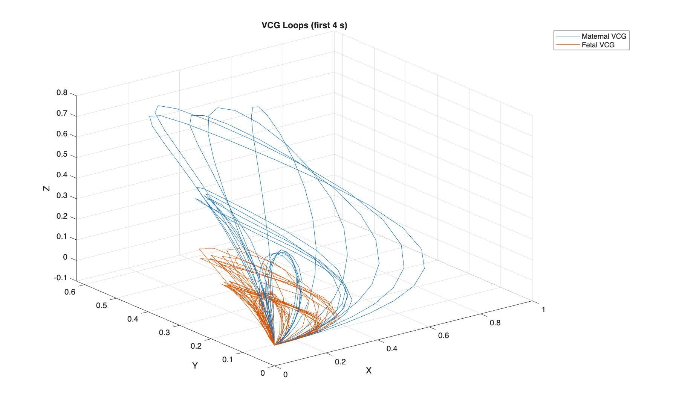
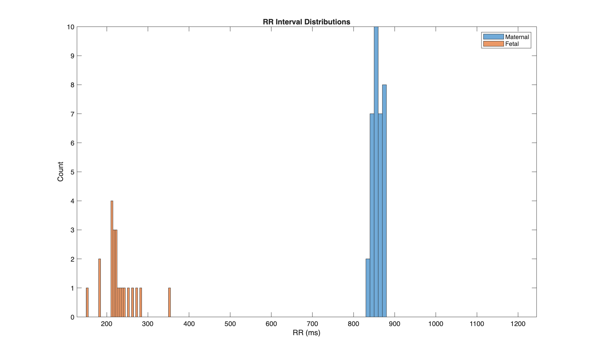

# Multichannel ECG Modeling with Stochastic Extensions (OSET)

## Methods
- **Simulators:** vcg\_gen\_stochastic for maternal (70 bpm) and fetal (150 bpm) VCGs with per-beat jitter (HR, amplitude, width, phase).
- **Projection:** 3D VCG → 12-lead via a fixed 12×3 lead field (orthonormal). Replace with inverse-Dower for higher physiological realism.
- **Noise:** Baseline wander (0.2–0.5 Hz), EMG-like 20–50 Hz, and white noise to target 15 dB SNR.
- **Sampling:** fs=500 Hz, duration=30 s.

## Results
| Metric | Value |
|---|---:|
| Mean SNR across 12 leads (dB) | 2.2 |
| Morphology variability (cosine, maternal-dom lead) | 0.076 |
| HRV SDNN (ms) – maternal | 11.6 |
| HRV SDNN (ms) – fetal | 399.3 |
| Avg cross-lead correlation | 0.235 |

### Figures
- 
- 
- 

## Discussion: Why Stochastic Modeling Matters
- **Physiological realism:** Real ECGs exhibit micro-variability in RR intervals and morphology due to autonomic tone, respiration, and conduction variability. Adding controlled randomness avoids overly periodic "toy" signals.
- **Algorithm stress-testing:** Jittered morphology + noise exposes edge cases for QRS detection, segmentation, features, and classifiers, improving robustness and generalization.
- **Maternal–fetal use-case:** Two asynchronous stochastic sources create realistic overlap useful for fetal QRS detection and source separation benchmarking.
- **Extensibility:** The same framework supports alternans, state switching (PVCs), and time-warping to model broader pathologies and conditions.

## Limitations
- Lead field here is a proxy; use measured/inverse-Dower matrices for clinical realism.
- Fetal HRV is approximate with a crude high-pass detector; better separation/detectors will improve accuracy.
- Excessive parameter jitter can yield non-physiological shapes; tune within realistic ranges.
